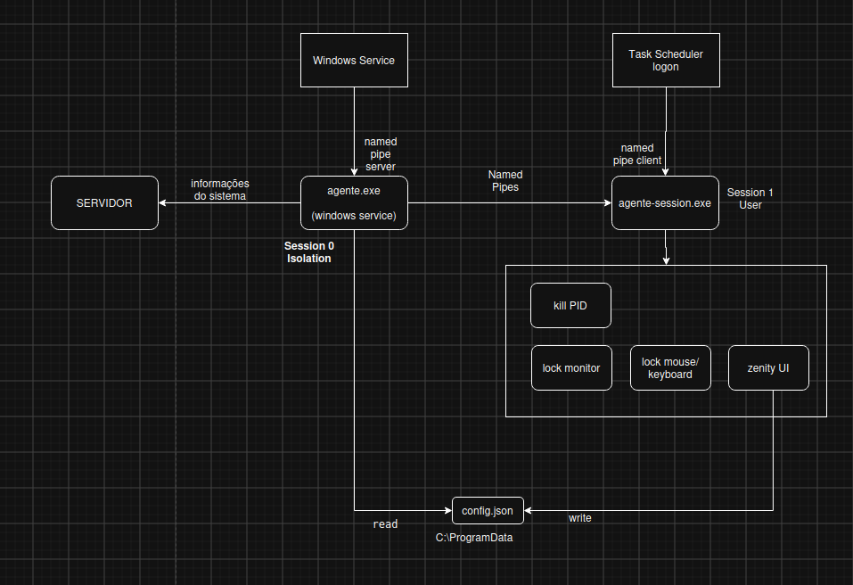
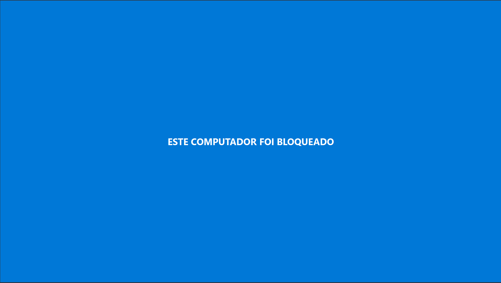
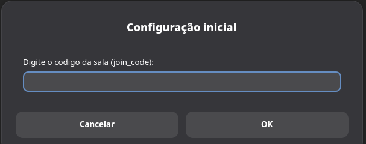

# Agente MoniTec

> Módulo cliente desenvolvido em **Go (Golang)** para coleta de dados e execução de comandos nos computadores monitorados.

Este diretório contém o código-fonte do **agente local** do sistema MoniTec. O agente é instalado em cada estação de trabalho dos alunos e é responsável por:

- Coletar informações básicas do computador (status, identificação, recursos);
- Enviar dados periodicamente ao **servidor central** via HTTP (polling);
- Receber e executar comandos remotos enviados pelo professor através da interface web.

---

## 📑 Sumário

- [Sobre o Agente](#sobre)
- [dependências](#dependências)
- [Arquitetura e Fluxo de Comunicação](#arquitetura)
- [Pré-requisitos](#requisitos)
- [Instalação e Compilação](#instalação-e-compilação)
- [Screenshots](#screenshots)

---

## sobre

O agente é o componente periférico do MoniTec, executado em segundo plano nos PCs dos alunos. Ele foi projetado para ser **leve, autônomo e de fácil distribuição**.

  
## dependências

google/uuid v1.6.0
kardianos/service v1.3.0
mouuff/go-rocket-update v1.5.6
ncruces/zenity v0.10.14
shirou/gopsutil/v3 v3.24.5

---

## arquitetura

O agente se comunica exclusivamente com o **servidor central** via requisições HTTP periódicas (polling).

### Fluxo de operação

1. **Inicialização do serviço**:  o Windows Service dispara o agente.exe, que roda na Session 0 (isolamento de serviços);
2. **Leitura de configuração**:  o agente.exe lê o arquivo config.json localizado em C:\ProgramData;
3. **Registro no servidor**:  o agente.exe coleta informações do sistema e envia para o SERVIDOR;
4. **Inicialização do agente de sessão**:  no logon do usuário, o Task Scheduler dispara o agente-session.exe na Session 1 (sessão do usuário);
5. **Comunicação via Named Pipes**:  o agente.exe (Session 0) atua como named pipe server e o agente-session.exe (Session 1) como named pipe client, estabelecendo comunicação entre as duas sessões;
6. **Execução de comandos**: ao receber instruções, o agente-session.exe executa ações na sessão do usuário — kill PID, lock monitor, lock mouse/keyboard e exibe diálogos via zenity UI;
7. **Atualização de configuração**:  o agente-session.exe pode escrever no config.json em C:\ProgramData, permitindo que o agente.exe leia as atualizações em execuções futuras.



---


## requisitos

- [Go](https://golang.org/dl/) instalado (versão `1.26.4x` ou superior);
- Acesso à rede local/internet para comunicação com o servidor;
- Permissões adequadas para execução de comandos no sistema operacional (se aplicável).

---

## instalação-e-compilação

## install setup (faster)
  [MoniTecSetup para Windows](https://github.com/3DBMonitoraEdu/TCC/releases/latest)
  
---
## Compilar

### Clonar o repositório e Compilar

```bash
git clone https://github.com/3DBMonitoraEdu/TCC.git
cd TCC/projeto/agente/
```

### Compilar

```bash
go build -o build/agente.exe cmd/agente/main.go

go build -o build/agente-session.exe cmd/agente-session/main.go
```

## 🔧 build setup

Criar o .exe de setup usado o [inno setup](https://jrsoftware.org/isinfo.php)

abra o arquivo **monitorEduSetup.iss** usando o **inno setup** e compile

o arquivo setup gerado vai estar localizado na pasta **dist**

### Arquivo de configuração (`config.json`)

o arquivo de configuração vai estar localizado em **c:\ProgramData\MoniTec\config.json

```json
{
  "agent_uuid": "",
  "join_code": "",
  "server_url": "http://192.168.15.13:4040",
  "interval_secs": 30,
  "disk_path": "C:\\",
  "blocked_hosts": []
}
```
**para alterar a url do servidor mude o "server_url" para a URL correta (EX: "http://localhost:4040", caso o servidor estiver local)**

o "interval_secs" serve para alterar o tempo de comunicação do agente com o servidor

---

## screenshots





## 👨‍💻 Autores

- **Vinicius Angelus Dos Santos**
- **Rubens Gabriel Policeno**

## 🎓 Orientadores

| Papel | Nome |
|-------|------|
| Orientador | Luiz Lima |
| Coorientador | Ricardo Palhares |
| Coorientador | Davi Vilar |

---

_Trabalho de Conclusão de Curso — Técnico em Desenvolvimento de Sistemas_

_ETEC Prof. Camargo Aranha — Centro Estadual de Educação Tecnológica Paula Souza_

_São Paulo, 2026_
